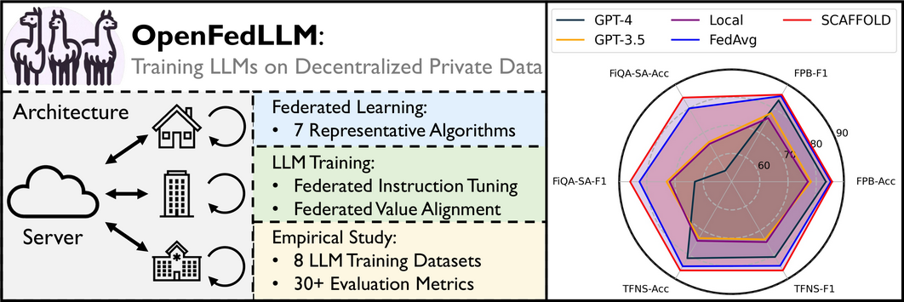

# OpenFedLLM: Training Large Language Models on Decentralized Private Data via Federated Learning

**OpenFedLLM** is an open-source research-use codebase for training *Large Language Models (LLM)* via federated learning (accepted by **KDD 2024**). Please check our [paper](https://arxiv.org/abs/2402.06954) for details and the corresponding empirical study.

OpenFedLLM includes the following key features:
- 7 **federated learning** algorithms (e.g., *FedAvg*, *FedProx*, *SCAFFOLD*, *FedAvgM*, etc.).
- 2 **LLM training** algorithms, including instruction tuning (i.e. *SFT*) and value alignment (i.e., *DPO*).
- 30+ **evaluation metrics** covering *general capabilities*, *medical QA*, *financial QA*, *code generation*, *math solving*, and more.




## 分布式部署

为了支持在多台机器上分布式部署，我们提供了拆分的服务端和客户端代码：

- `server.py`: 服务端代码，负责全局模型聚合和分发
- `client.py`: 客户端代码，负责本地模型训练

### 部署架构

在4台机器上的部署架构如下：

1. 一台机器作为服务端（参数服务器）
2. 三台机器作为客户端（训练节点）

### 部署步骤

#### 1. 环境准备

在所有机器上安装依赖：

```bash
pip install -r requirements.txt
```

#### 2. 数据准备

在每台客户端机器上准备本地数据集。确保每台机器上的数据是不同的，以符合联邦学习的隐私保护特性。

#### 3. 配置修改

修改 `config.py` 文件中的参数以适应分布式部署：

- `num_clients`: 设置为3（客户端数量）
- `sample_clients`: 设置为参与每轮训练的客户端数量

#### 4. 服务端启动

在服务端机器上运行：

```bash
# 使用HTTP通信版本
python server_http.py

# 或使用提供的启动脚本
run_server.bat
```

#### 5. 客户端启动

在每台客户端机器上运行：

```bash
# 使用HTTP通信版本
python client_http.py

# 或使用提供的启动脚本
run_client.bat
```

### 通信实现

我们提供了基于HTTP的通信实现示例：

1. **HTTP/REST API**: 使用Flask实现服务端API，客户端通过HTTP请求与服务端通信
   - 服务端代码: `server_http.py`
   - 客户端代码: `client_http.py`
   - 启动脚本: `run_server.bat` 和 `run_client.bat`

其他可选的通信机制：

1. **Socket通信**: 使用Python的socket库实现自定义通信协议
2. **消息队列**: 使用RabbitMQ、Kafka等消息队列系统

### 注意事项

1. 确保所有机器在同一网络中，能够互相通信
2. 配置防火墙规则，开放必要的端口
3. 在生产环境中，建议使用加密通信以保护模型参数
4. 根据实际硬件配置调整训练参数（batch_size、learning_rate等）

## News🔥
- **2024-09:** FedLLM-Bench is accepted by **NeurIPS 2024** Datasets and Benchmarks Track!
- **2024-06:** We released the first realistic benchmark for FedLLM: FedLLM-Bench. Check the [Paper](https://arxiv.org/pdf/2406.04845) | [Code](https://github.com/rui-ye/FedLLM-Bench).
- **2024-05:** OpenFedLLM is accepted by **KDD 2024**!.

## Setup

Clone the repo, submodules and install the required packages.

```
git clone --recursive --shallow-submodules https://github.com/rui-ye/OpenFedLLM.git
cd OpenFedLLM
conda create -n fedllm python=3.10
conda activate fedllm
pip install -r requirements.txt
source setup.sh
```

## Training

We provide training scripts under `training_scripts/`. Try them out from the top-level directory of this repository.

### Federated Instruction Tuning

The training script is in `training_scripts/run_sft.sh`.

```
CUDA_VISIBLE_DEVICES=1 python main_sft.py \
 --model_name_or_path "meta-llama/Llama-2-7b-hf" \
 --dataset_name "vicgalle/alpaca-gpt4" \
 --dataset_sample 20000 \
 --fed_alg "fedavg" \
 --num_clients 20 \
 --sample_clients 2 \
 --max_steps 10 \
 --num_rounds 200 \
 --batch_size 16 \
 --gradient_accumulation_steps 1 \
 --seq_length 512 \
 --peft_lora_r 32 \
 --peft_lora_alpha 64 \
 --use_peft \
 --load_in_8bit \
 --output_dir "./output" \
 --template "alpaca" \
```

Key arguments:

- `model_name_or_path`: the name or local location of your base model
- `template`: template for chatting. Define your own template in `utils/template.py`.
- `dataset_name`: the name of dataset. You may modify `utils/process_dataset.py` if your interested dataset has not been supported.
- `dataset_sample`: needed if you want to sample a specific number of samples from the original dataset.
- `fed_alg`: the name of federated learning algorithm
- `num_clients`/sample_clients: `num_clients` clients in total, `sample_clients` clients for each round
- `max_steps`: the number of model update steps for one client at each round.

### Federated Value Alignment

The training script is in `training_scripts/run_dpo.sh`.

```
python main_dpo.py --template "vicuna_v1.1"
```

Note that the main difference between the usage of `main_sft.py` and `main_dpo.py` lies in the `template` argument. We plan to make them consistent in the future.
- For SFT, templates are defined in `utils/template.py`
- For DPO, templates are defined in `utils/conversation.py`

## Evaluation

Evaluation codes are put in `evaluation/` directory. Most of our evaluations follow existing high-incluence open-source repos. Please refer to each sub-directory for the corresponding detailed README and running script.

For example, `evaluation/open_ended/` include open-ended evaluations on three benchmarks, covering MT-Bench, Vicuna Bench, and AdvBench; see [README.md](evaluation/open_ended/README.md).

## Citation

Please cite our paper if you find the repository helpful.

```
@inproceedings{ye2024openfedllm,
  title={Openfedllm: Training large language models on decentralized private data via federated learning},
  author={Ye, Rui and Wang, Wenhao and Chai, Jingyi and Li, Dihan and Li, Zexi and Xu, Yinda and Du, Yaxin and Wang, Yanfeng and Chen, Siheng},
  booktitle={Proceedings of the 30th ACM SIGKDD Conference on Knowledge Discovery and Data Mining},
  pages={6137--6147},
  year={2024}
}
```
